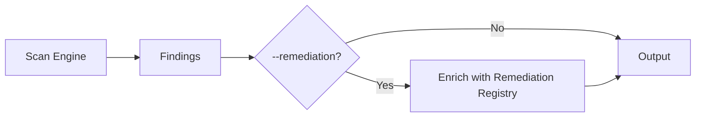
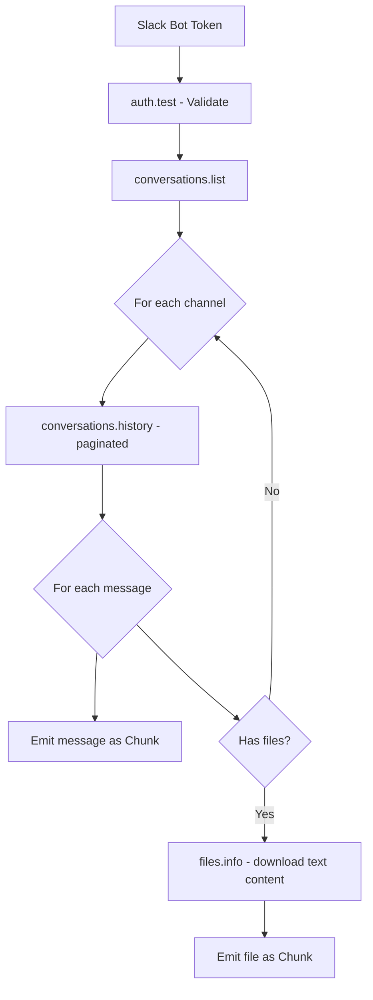
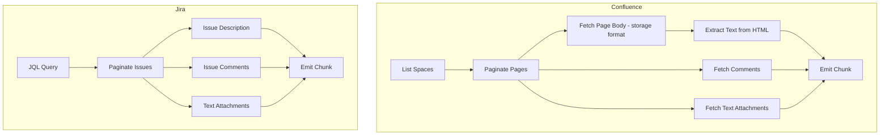
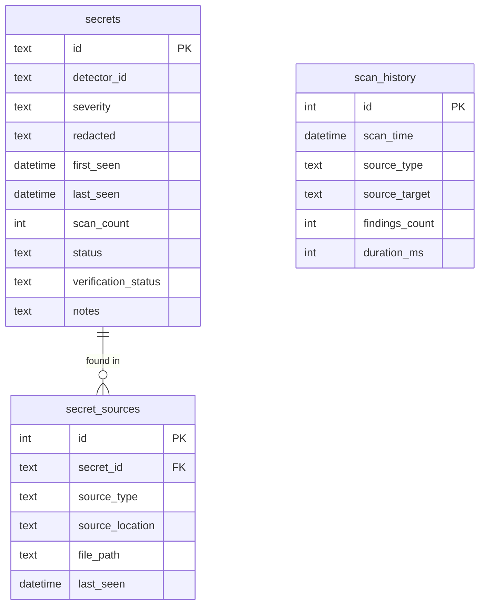
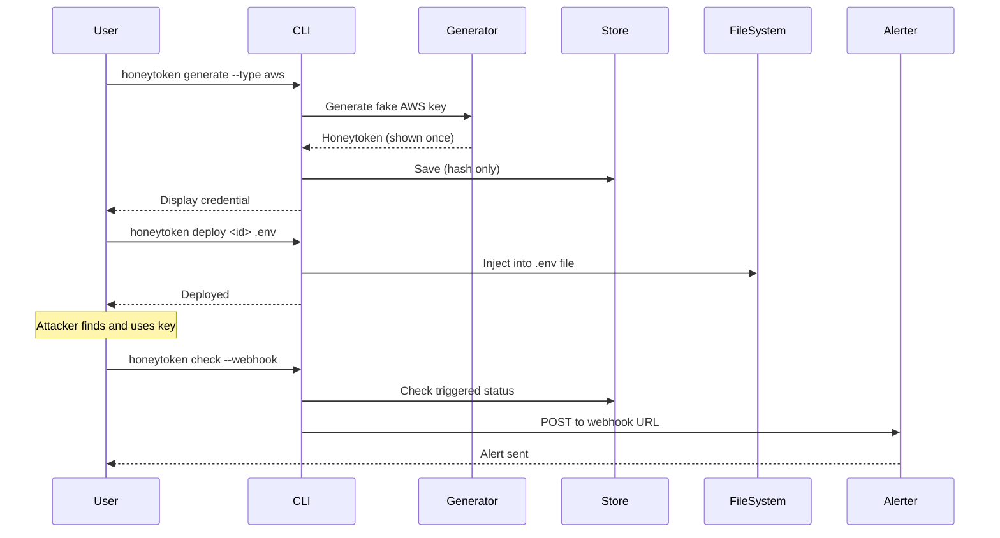
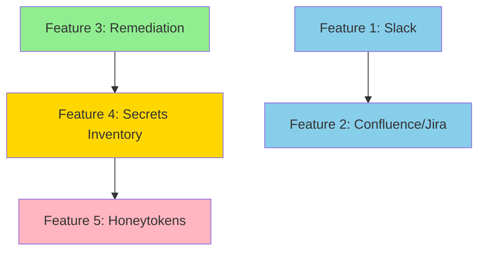

# Leakwatch - Mid-Term Features: Architectural Analysis

> **Document Version:** 1.0
> **Date:** 2026-03-24
> **Status:** Approved
> **Last Updated:** 2026-03-24

---

## Overview

This document contains the detailed architectural analysis and implementation plan for 5 mid-term features that extend Leakwatch beyond code repositories into collaboration tools, remediation guidance, secrets lifecycle management, and deception-based defense.

## Implementation Order

| Phase | Feature | Duration | Version | Complexity |
|-------|---------|----------|---------|------------|
| 1 | Remediation Guidance | 2 weeks | v1.1.0 | Small-Medium |
| 2 | Slack Workspace Scanning | 3-4 weeks | v1.2.0 | Medium-Large |
| 3 | Confluence/Jira Scanning | 4-5 weeks | v1.3.0 | Large |
| 4 | Secrets Inventory | 4-5 weeks | v1.4.0 | Large |
| 5 | Honeytokens | 3-4 weeks | v1.5.0 | Medium-Large |
| **Total** | | **16-20 weeks** | | |

---

## Feature 1: Remediation Guidance

### Description

After detecting a leaked secret, provide actionable, context-aware remediation instructions: how to rotate or revoke the secret, which provider consoles to visit, what services might be affected, and an incident response checklist. Transforms Leakwatch from a detection tool into a response-enabling tool.

### Architecture

Extends the existing `Finding` model with a `Remediation` type. Each detector ID maps to remediation data via a registry. No new interfaces needed.

**New package:** `internal/remediation/`

```
internal/remediation/
├── remediation.go       # Remediation type and registry
├── guidance.go          # Built-in remediation data for all detectors
└── remediation_test.go
```

**Data model addition** (`pkg/finding/finding.go`):

```go
type Remediation struct {
    Title      string   `json:"title"`
    Steps      []string `json:"steps"`
    DocURL     string   `json:"doc_url,omitempty"`
    ConsoleURL string   `json:"console_url,omitempty"`
    Urgency    string   `json:"urgency"`
    Checklist  []string `json:"checklist,omitempty"`
}
```

### Pipeline Integration



### CLI Changes

```
--remediation             Include remediation guidance in output (default: false)
--remediation-format      Detail level: brief | full (default: brief)
```

### Implementation Tasks

1. Define `Remediation` type in `pkg/finding/finding.go`
2. Create `internal/remediation/` package with registry
3. Write remediation data for all 10+ existing detectors
4. Add flags to `cmd/scan_common.go`
5. Enrich findings in `executeScan()` post-processing
6. Update all 4 formatters (JSON, SARIF, CSV, Table)
7. Write tests

### Dependencies

None. Independent feature.

### Risks

- Content maintenance: remediation instructions must stay current with provider changes
- Output size: full remediation can significantly increase output; brief/full option mitigates this

---

## Feature 2: Slack Workspace Scanning

### Description

Scan Slack workspace messages, channels, uploaded files, and shared snippets for leaked secrets. Developers frequently paste API keys, database URLs, and credentials into Slack channels during debugging or onboarding.

### Architecture

New `SlackSource` implements `source.Source`, following the S3/GCS pattern.

**New package:** `internal/source/slack/`

```
internal/source/slack/
├── slack.go          # SlackSource implements source.Source
├── client.go         # slackClient interface (testability)
├── options.go        # Functional options
└── slack_test.go
```

### Scan Pipeline



### External Dependencies

- **Library:** `github.com/slack-go/slack` (pure Go, no CGO)
- **Auth:** Bot Token (`xoxb-...`) via `--token` or `LEAKWATCH_SLACK_TOKEN`
- **OAuth Scopes:** `channels:history`, `channels:read`, `groups:history`, `groups:read`, `files:read`
- **Rate Limiting:** Slack Tier 3 (~50 req/min for conversations.history)

### Data Model Changes

New `SourceMetadata` fields:

```go
Channel     string `json:"channel,omitempty"`
ChannelName string `json:"channel_name,omitempty"`
MessageUser string `json:"message_user,omitempty"`
MessageTS   string `json:"message_ts,omitempty"`
ThreadTS    string `json:"thread_ts,omitempty"`
```

### CLI Design

```
leakwatch scan slack --token xoxb-... [flags]
  --channels string       Channel names/IDs to scan (default: all)
  --exclude-channels      Channels to exclude
  --since string          Oldest message date (RFC3339)
  --include-dms           Include direct messages (default: false)
  --include-files         Scan uploaded files (default: true)
  --rate-limit float      Max API req/sec (default: 20)
```

### Implementation Tasks

1. Add `github.com/slack-go/slack` to `go.mod`
2. Create `slackClient` interface and API wrapper
3. Implement `SlackSource` with rate-limited pagination
4. Add Slack fields to `SourceMetadata`
5. Create `cmd/scan_slack.go`
6. Write tests with mocked client
7. Write guide: `docs/guides/slack-scanning.md`

### Risks

- Rate limiting complexity (tiered per endpoint)
- Large workspaces (millions of messages — need aggressive date filtering)
- DM scanning raises privacy concerns (opt-in only)
- Token security (must not log the bot token)

---

## Feature 3: Confluence/Jira Scanning

### Description

Scan Atlassian Confluence pages, comments, and attachments, plus Jira issue descriptions, comments, and attachments. Documentation and issue trackers are common places where developers paste credentials.

### Architecture

Two sources sharing a common Atlassian API client layer. Supports both Cloud and Server/Data Center editions.

**New packages:**

```
internal/source/
├── atlassian/              # Shared client
│   ├── client.go           # HTTP client, auth, rate limiting
│   ├── client_test.go
│   └── types.go
├── confluence/
│   ├── confluence.go       # ConfluenceSource
│   ├── options.go
│   └── confluence_test.go
└── jira/
    ├── jira.go             # JiraSource
    ├── options.go
    └── jira_test.go
```

### Scan Pipelines



### External Dependencies

- **No external library** — `net/http` with thin client wrapper
- **HTML parsing:** `golang.org/x/net/html` for Confluence storage format extraction
- **Auth:**
  - Cloud: email + API token (`--email`, `--api-token`)
  - Server/DC: Personal Access Token (`--pat`)

### Data Model Changes

New `SourceMetadata` fields:

```go
AtlassianURL string `json:"atlassian_url,omitempty"`
SpaceKey     string `json:"space_key,omitempty"`
PageTitle    string `json:"page_title,omitempty"`
PageID       string `json:"page_id,omitempty"`
ProjectKey   string `json:"project_key,omitempty"`
IssueKey     string `json:"issue_key,omitempty"`
ContentType  string `json:"content_type,omitempty"`
```

### CLI Design

```
leakwatch scan confluence --url URL --email EMAIL --api-token TOKEN [flags]
  --spaces string         Space keys to scan (default: all)
  --since string          Pages modified after date
  --include-attachments   Scan text attachments (default: true)

leakwatch scan jira --url URL --email EMAIL --api-token TOKEN [flags]
  --projects string       Project keys (default: all)
  --jql string            Custom JQL filter
  --since string          Issues updated after date
  --include-attachments   Scan text attachments (default: true)
```

### Implementation Tasks

1. Create shared `internal/source/atlassian/` client
2. Implement Confluence source with HTML extraction
3. Implement Jira source with JQL pagination
4. Add Atlassian fields to `SourceMetadata`
5. Create `cmd/scan_confluence.go` and `cmd/scan_jira.go`
6. Write tests with `httptest.NewServer` mocks
7. Write guide: `docs/guides/atlassian-scanning.md`

### Risks

- Cloud vs Server API differences (different paths, pagination formats)
- HTML content parsing complexity (Confluence storage format)
- Permissions: API token may not have access to all spaces/projects
- Binary attachments must be skipped (only text-based files)

---

## Feature 4: Secrets Inventory

### Description

Persistent, centralized inventory of all discovered secrets across multiple scans. Track when secrets were first/last seen, which sources they appear in, verification status over time, and remediation state. Transforms Leakwatch from a point-in-time scanner into a secrets lifecycle management tool.

### Architecture

Introduces a SQLite persistence layer and new CLI command group.

**New packages:**

```
internal/inventory/
├── inventory.go         # Business logic service
├── store/
│   ├── store.go         # Store interface
│   ├── sqlite.go        # Pure Go SQLite implementation
│   ├── migrations.go    # Schema creation
│   └── sqlite_test.go
└── inventory_test.go
```

### Database Schema



### External Dependencies

- **Library:** `modernc.org/sqlite` — pure Go SQLite (no CGO, critical for cross-compilation)

### CLI Design

```
leakwatch inventory list [--status active] [--severity high] [--format table]
leakwatch inventory stats [--format table]
leakwatch inventory show <secret-id>
leakwatch inventory update <secret-id> --status remediated --notes "Rotated key"
leakwatch inventory export [--format json] [-o inventory.json]
leakwatch inventory reverify [--status active]

# Scan integration:
leakwatch scan fs /path --inventory [--db ~/.leakwatch/inventory.db]
```

### Implementation Tasks

1. Add `modernc.org/sqlite` to `go.mod`
2. Create `Store` interface and SQLite implementation
3. Create `Inventory` service with upsert/dedup logic
4. Add `--inventory` and `--db` flags to scan commands
5. Wire inventory persistence into `executeScan()`
6. Create `cmd/inventory*.go` subcommands (list, stats, show, update, export, reverify)
7. Write tests with in-memory SQLite
8. Write guide: `docs/guides/secrets-inventory.md`

### Risks

- CGO constraint: must use `modernc.org/sqlite` (slightly slower but pure Go)
- CI/CD environments: ephemeral containers need `--db` flag
- Concurrent access: use WAL mode + retry for parallel scans
- Only redacted values stored (never raw secrets)

---

## Feature 5: Honeytokens

### Description

Generate and deploy realistic-looking but fake credentials that trigger alerts when used. Provides early warning for repository compromise, insider threats, or credential scraping.

### Architecture

New top-level command group with generators, persistence, and webhook alerting.

**New packages:**

```
internal/honeytoken/
├── honeytoken.go           # Core types and service
├── generator/
│   ├── generator.go        # Generator interface
│   ├── aws.go              # Fake AKIA... keys
│   ├── github.go           # Fake ghp_... tokens
│   ├── generic.go          # Generic API keys
│   └── generator_test.go
├── store/
│   ├── store.go            # Store interface
│   └── sqlite.go           # Shares DB with inventory
├── alerter/
│   ├── alerter.go          # Alerter interface
│   ├── webhook.go          # HTTP POST webhook
│   └── alerter_test.go
└── honeytoken_test.go
```

### Workflow



### External Dependencies

- **Storage:** Reuses `modernc.org/sqlite` from Feature 4
- **Webhook:** `net/http` (no new dependencies)
- **AWS canary (optional):** `aws-sdk-go-v2` (already a dependency)

### CLI Design

```
leakwatch honeytoken generate --type aws|github|generic --webhook URL
leakwatch honeytoken deploy <id> <path> [--key AWS_ACCESS_KEY_ID] [--format env|yaml|json]
leakwatch honeytoken list [--status active|revoked|triggered]
leakwatch honeytoken revoke <id>
leakwatch honeytoken check [--webhook]

# Scan integration:
leakwatch scan fs /path --detect-honeytokens
```

### Implementation Tasks

1. Create `Generator` interface and implementations (AWS, GitHub, generic)
2. Create honeytoken store (extends inventory DB)
3. Create webhook alerter
4. Create `cmd/honeytoken*.go` subcommands
5. Add `--detect-honeytokens` flag to scan commands
6. Write tests
7. Write guide: `docs/guides/honeytokens.md`

### Risks

- Generated credentials must look realistic but never accidentally work
- Value shown once, then only hash stored — clearly communicate this
- File injection must not corrupt existing files
- Depends on Feature 4's SQLite infrastructure

---

## Dependency Graph



**Legend:** Green = Start here | Blue = API sources | Yellow = Persistence | Pink = Advanced
